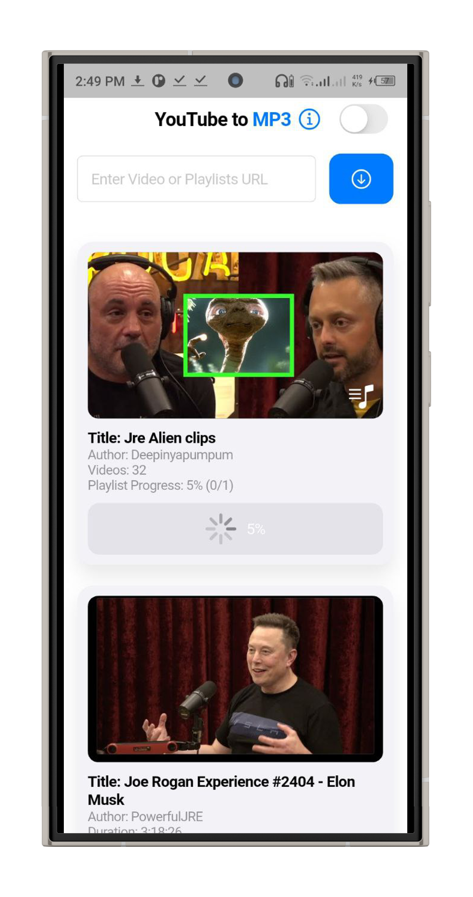
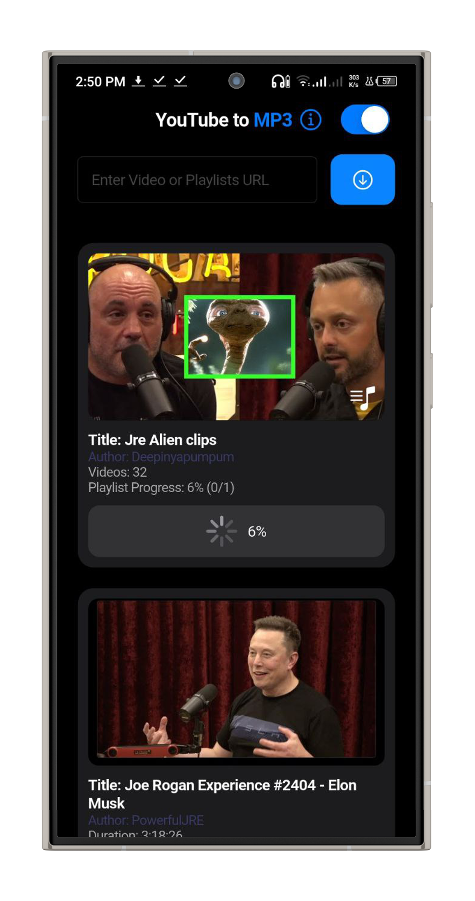
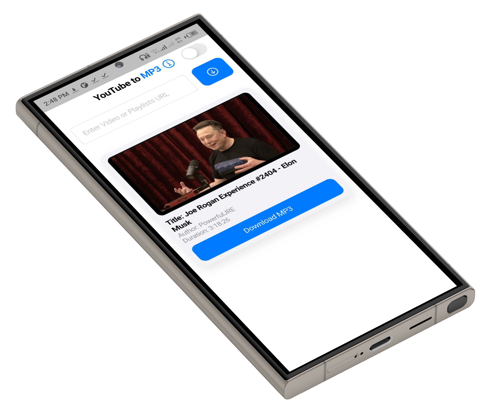

# 🎵 MP3Tube — YouTube MP3 Downloader App

**MP3Tube** is a modern, lightweight Flutter app that converts and downloads YouTube videos or playlists into MP3 files.  
It features a clean iOS-style interface, fast performance, and automatic file management.

---

## 🚀 Features

### 🧠 Smart URL Recognition
- Detects automatically whether a link is a **single video** or a **playlist**.
- Fetches metadata like title, author, duration, and thumbnail.
- Async fetching with smooth UI feedback.

### 🎵 Audio Download Engine
- Downloads MP3s directly to `/storage/emulated/0/Download/MP3tube`.
- Supports **videos and playlists** with background queueing.
- Auto-registers audio files with Android’s media scanner.

### 📱 Interface
- iOS-style **Cupertino design** with smooth animations.
- Real-time **progress indicators** for downloads.
- Toggle between **dark** and **light** modes.
- In-app info modal linking to developer portfolio.

### 🔒 Permissions & Storage
- Automatically requests storage permissions.
- Creates organized folders for downloaded audio.

### 📦 Playlist Support
- Downloads all tracks in a playlist sequentially.
- Displays progress (e.g., `3/10 downloaded`).
- Skips broken links safely.

### ⚡ Notifications & Alerts
- Clean **CupertinoAlertDialog** popups for errors and completion messages.
- Smart feedback like:
  - “Download started”
  - “Playlist detected”
  - “All tracks downloaded”

### 🌙 Dark Mode
- Persistent light/dark mode toggle.
- Dynamic theming across UI elements.

### 🧩 Modular Architecture
- Decoupled logic for fetching info, managing downloads, and updating UI.
- Custom `DownloadTask` structure for progress tracking.
- Sanitized filenames to avoid invalid characters.

---

## 🧰 Built With
- **Flutter (Dart)**
- `permission_handler`
- `overlay_support`
- `url_launcher`
- `Cupertino` Widgets (iOS design components)

---

## 📱 Screenshots

| Light Mode | Dark Mode | Tilt Preview |
|-------------|------------|--------------|
|  |  |  |

---

## 🎬 App Demo

See how MP3Tube works:  
[▶ Watch Showcase Video](mp3tube_pics/showcase-video.gif)

---

## 📦 Installation

1. Download the APK file: [`mp3tube.apk`](apk/Mp3Tube.apk)
2. Enable **Install from Unknown Sources** in your Android settings.
3. Open the APK and install.
4. Start downloading your favorite audio instantly.

---

## 🛠️ Technical Details

| Component | Description |
|------------|-------------|
| **Platform** | Android |
| **Language** | Flutter / Dart |
| **Minimum SDK** | Android 7.0 (API 24) |
| **Storage Access** | Local file system |
| **Design** | Material 3 + Cupertino Hybrid |

---

## ⚖️ License

This project is licensed under the **MIT License**.  
Feel free to use, modify, or share it responsibly.

---

## 👨‍💻 Developer

**Developed by Abdallah Driouich**  
📧 [contact@driouich.me](mailto:contact@driouich.me)  
🌐 [portfolio.driouich.site](https://portfolio.driouich.site)

---

> _MP3Tube — Simple. Fast. Free._

